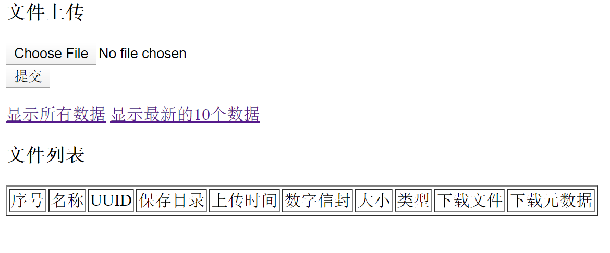
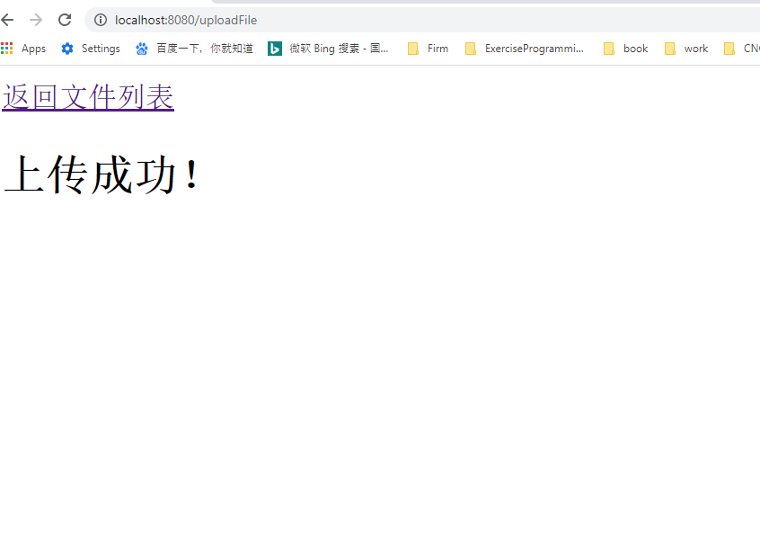
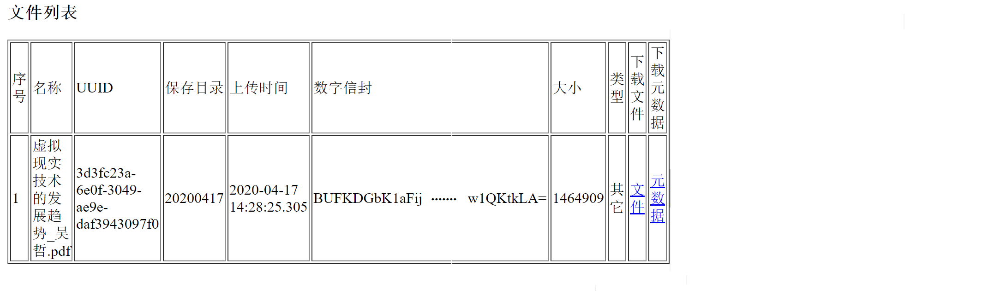
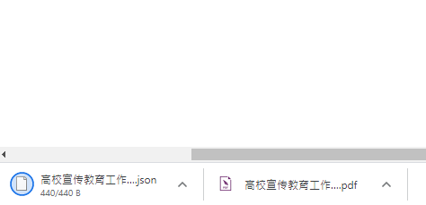

# 简单的文件系统项目

> 项目主要分为两部分，均为Maven项目(我是在idea中编写的)


* 前端服务器（Front_End Server）

  ```
  功能：
  	主要完成与浏览器的交互，处理文件的上传下载、文件列表的更新、加密等
  实现方式：
  	使用SpringBoot,JSP等，实现简单的前端Web服务器
    
  在浏览器输入http://localhost:8080/   
  就可以访问
  ```

* 后端服务器(Back_End Server)

  ```，
  功能：
  	主要完成文件的存储，解密、校验等
  实现方式：
  	使用内嵌式的Jetty作为后端服务器，通过Servlet与前端服务器进行通信；使用内嵌式的Derby作为数据库，通过JDBC处理数据
  
  这部分程序从MyJetty类处开始启动
  ```
  

* 主要实现功能

  ```
  1.上传文件
  2.下载文件、文件元数据（JSON格式）
  3.获取元数据
  4.接口检验
  5.文件列表显示
  6.文件加密、解密
  8.显示所有上传文件元数据
  7.显示最近10个上传文件元数据
  ```
  

* 功能图片


> 页面图





> 上传文件元数据



> 下载文件和元数据


